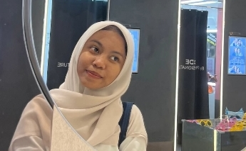

<!-- Profil GitHub Aqilah Al Khalifi -->

<h1 align="center">Hi there 👋, I'm Aqilah Al Khalifi</h1>
<h3 align="center">🌸 A lifelong learner who loves to explore the world of IT & make friends 🌸</h3>

  

---

### ✨ About Me  
🌱 I love learning new things related to **Web Design, App Design, UI/UX, Conflict Mediation, E-learning**, and of course **Travelling & collecting experiences**.  
💡 I enjoy connecting with people and building friendships along the way.  

---

### 📊 GitHub Stats  

  

  
  

  

  

---

### 🚀 Tech Stack  

  

---

### 📌 Featured Projects  
- 🔥 [Top Project Placeholder](#)  
- 🎨 [UI/UX Playground](#)  
- 🌍 [Travelling Notes](#)  

---

### 📈 Activity Graph  

  

---

### 🌐 Connect With Me  

  
  

---

✨ _“Design is the bridge between imagination and reality. I’m here to keep learning, creating, and connecting.”_ ✨
